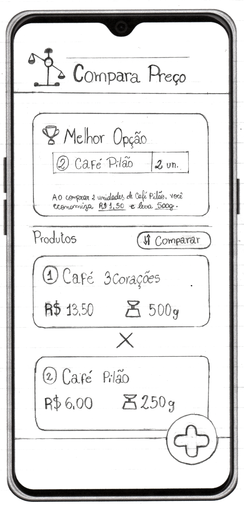

# COMPARADOR DE PREÇOS

Este código demonstra a lógica por trás de um aplicativo hipotético que **compararia o preço e o peso de dois ou mais produtos de supermercado**e retornaria qual o **mais vantajoso para o comprador final.**

## Jornada do usuário

**Dados de entrada:**

Lista de produtos com:

-  Nome do produto
-  Preço unitário
-  Unidade de medida
-  Peso unitário

**Fluxo:**

1. Abrir app
2. Carregar tela de apresentação (loading)
3. Carregar tela inicial

4. Fazer isso para cada novo produto a ser comparado - tela de formulário

   -  Clicar no botão com o "ícone de +" para **adicionar novo produto**
   -  Carregar formulário para adicionar produto
   -  Preencher **nome, valor unitário, unidade de medida e peso do produto**
   -  Clicar no botão de "adicionar produto"
   -  Fechar tela de formulário
   -  Mostrar card com dados do produto adicionado

5. Quando todos os produtos a serem comparados já estiverem sido adicionados, **clicar no botão "comparar"**

---

## Backend

1. Receber uma **lista de produtos** com nome, valor unitário, unidade de medida e peso de cada produto
2. Verificar se todos os produtos **possuem a mesma unidade de medida**

   -  Se não: - Se os produtos estiverem em **gramas e kilogramas**, converter todos para **gramas** - Se os produtos estiverem em **litros e mililitros**, converter todos para \*\*mililitros\*\*
      > Dessa forma, teremos uma lista onde todos os produtos possuem a mesma unidade de medida

3. Identificar **qual dos produtos possui o maior peso** (em g ou ml)

   > O produto de maior peso servirá de referência para os próximos cálculos

4. Criar uma lista nova com **todos os produtos exceto o produto de maior peso**
5. Nessa lista nova, para cada um dos produtos que ela tiver, calcular
   -  **quantidade de unidades do produto** = peso do produto / maior peso identificado
   -  **peso total** = peso do produto \* quantidade de unidades do produto
   -  **preco total** = preço do produto \* quantidade de unidades do produto

> Após esse passo, podemos dizer qual a quantidade de produtos (de cada item dessa nova lista) necessária para alcançar o maior peso identificado. Com isso, temos também o preço unitário do produto e o preço total dessa possível compra.

6. **Unificar todos os produtos** com peso e preço atualizado e o produto de maior peso **em uma única lista**

> Desse modo, temos uma lista onde todos os produtos possuem a mesma unidade de medida convertida e o mesmo peso total, mas com o preço total referente à quantidade de produtos necessária para alcançar o maior peso

7. Mapear todos os produtos dessa ultima lista e **verificar qual deles possui o menor preço**

8. Exibir mensagem com o produto encontrado
